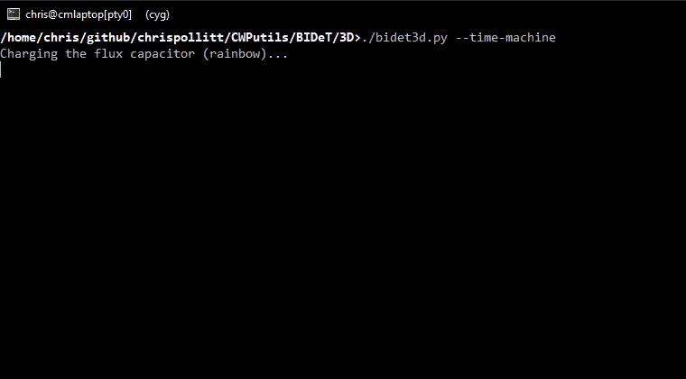

# BIDeT3D

You know banner. You know FIGlet. You may have heard of TOIlet. You met BIDeT.

Now it has a third dimension: **1990s WordArt, extruded into real 3D, printed in
your terminal as SIXEL graphics.**

    ./bidet3d.py -P superhero "Hello, World!"
    ./bidet3d.py -P chrome --spin "Spin me"
    ./bidet3d.py --gallery
    ./bidet3d.py --time-machine "BIDeT"

(The same as a small [MP4](images/time-machine.mp4), 220 KB.)

All 30 presets of [css3wordart](https://github.com/arizzitano/css3wordart) are
here, including the arc / inverted-arc / squeeze baselines that the CSS version
marked "not achievable". Encoding goes through
[libsixel](https://github.com/saitoha/libsixel).

## Install

No build step; it is one Python file. Try it in place with `./bidet3d.py`, or:

    make installreq        # Debian/Ubuntu: python3-pil python3-numpy libsixel-bin (as root)
    make check             # lint + render every preset
    sudo make install      # bidet3d, man page, docs, the gfx-conv converters (PREFIX=/usr/local; DESTDIR supported)
    make help              # all targets

Elsewhere: `pip install -r requirements.txt` plus libsixel (Cygwin setup, brew, ...).
It runs on old systems too (tested down to Python 3.7, Pillow 5.4, numpy 1.16).
`make install` also puts the [`gfx-conv`](../gfx-conv/) converters in `share/BIDeT3D/gfx`, linked into `bin` as
`sixel2ans`, `sixel2iterm`, `sixel2kitty` and `sixel2tek`; `--format` uses them.
`make textures` fetches the optional Word textures (see below);
`sudo make install` installs them if you have them.
The man page is `bidet3d.1`; read it with `make man`.

## How it works

    text -> mask -> baseline warp -> material (gradient/texture) + bevel light
         -> stack of depth slices -> perspective camera -> SIXEL (libsixel)

It is a small software renderer (Pillow + numpy), not a font-outline mesher:
the face is one textured quad, the extrusion is a dense stack of shaded
silhouettes seen through a perspective projection, so rotation, pitch, roll
and animation all come from the same math. Near edge-on (yaw ~90) the side
walls show a little banding; raise `SLICE_DENSITY` in the script if it bothers you.

## Requirements

- Python 3 with **Pillow** and **numpy**
- **libsixel**: either its Python binding (`pip install libsixel-python`) or the
  `img2sixel` program. The binding is used when present, `img2sixel` otherwise.
- A SIXEL terminal (see `../v1/TERMINAL-SUPPORT-LIST.txt`: mintty, xterm
  `-ti vt340`, mlterm, WezTerm, foot, iTerm2, ...)
- Fonts: Arial Bold, Times New Roman Bold and Impact are used when found
  (Windows, Cygwin `/cygdrive/c/Windows/Fonts`, WSL, macOS); otherwise
  Liberation / DejaVu; `-f` picks any font file.

## Options

Shared with BIDeT: `-b` background, `-c` colour, `-f` font, `-l` line spacing,
`-p` preserve newlines, `-s` size (pixels; default fits the terminal), `-w` wrap
width, `-d` debug, `-v` version. Text comes from the arguments or stdin.

| option | meaning |
| --- | --- |
| `-a`, `--art` | input is ASCII art: lines stay aligned, monospace font, no letter-spacing, line spacing 0.9 (implies `-p`). Piped multi-line art such as `cowsay` output is detected automatically; `--no-art` disables that |
| `-P NAME` | preset (`--list-presets`), or `random`; default `rainbow` |
| `--gallery` | show every preset with your text |
| `--depth EM` | extrusion depth |
| `--yaw/--pitch/--roll DEG` | camera angles (`--view=-30,10,0` for all three) |
| `--shape S` | `plain arc inverted-arc squeeze wave` baseline warp |
| `--perspective F` | camera distance in text widths (smaller = more perspective) |
| `--spin`, `--sway DEG` | animate by rotating, or swinging; Ctrl-C stops |
| `--time-machine` | cycle through banner (1983), FIGlet, TOIlet, BIDeT, then BIDeT3D spinning; `--stage-time SEC` per era |
| `--spin-speed`, `--fps`, `--frames` | animation control (degrees/s, frames/s, stop after N) |
| `--colors N` | SIXEL palette size (default 256; fewer = smaller frames, more banding) |
| `-F`, `--format F` | output format: `sixel` (default), `kitty`, `iterm`, `ansi`, `tek`, `tek-dots`, `tek-contour`, or `auto` (needs [`../gfx-conv`](../gfx-conv/); no animation) |
| `--png FILE` | write a PNG instead of SIXEL (handy for testing) |
| `--max-width PX` | cap the image width (faster, less data) |
| `--dither` | Floyd-Steinberg dithering for still pictures (default off: less speckle) |
| `--transparent` | leave the background unpainted (still pictures); automatic when the terminal won't report its colour |
| `--force` | print SIXEL even if the terminal does not report support |
| `--cell WxH` | terminal cell size in pixels if it can't be detected |

The black presets (`up`, `arc`, `squeeze`, ...) used to sit on a light page, so
their "ink" turns white on dark terminals.

`-F` prints something else for terminals that don't do SIXEL: the kitty or iTerm2 image protocols,
ANSI art (`-F ansi` works in any UTF-8 terminal), or Tektronix vectors for `xterm -t`. `-F auto` picks one
from what the terminal says about itself. Details in [`../gfx-conv`](../gfx-conv/).

Like BIDeT's `test-sixel`, it first asks the terminal whether it reports SIXEL
(DA1 attribute 4) and stops with "Sixel not supported" if it says no
(`--force` or `LSIX_FORCE_SIXEL_SUPPORT=1` to print anyway; piped output and
`--png` skip the check).

**Background.** In the same exchange it asks for the background colour (OSC 11) so
the picture blends in, and keeps that colour exact through quantization (libsixel's
own quantizer turned white into 247), within the 1% steps SIXEL colour registers
allow. `-b COLOR` overrides. If the terminal will not say (Windows Terminal does
not answer OSC 11, so every tool that guesses its colour gets it wrong there), a
still picture is sent with a **transparent background** (`P2=1`, the colour is
left unpainted), so the terminal shows its own. `--transparent` forces that.
Transparent pictures keep a real alpha channel, so edge colours are the
material's own (no halo of the wrong background); the edge itself is a hard
1-bit step, which is all SIXEL transparency can express. An animation on such a terminal erases its picture area before drawing each frame
(otherwise the previous frame would show through the unpainted pixels), which may
flicker a little on terminals without synchronized output; `-b COLOR` gives opaque
frames instead. `-d` prints the raw replies the terminal gave.

## Time machine

`--time-machine` shows your text the way each generation of big terminal text would
have drawn it, winding a year counter forward between them: `banner(1)` (1983),
FIGlet (1991), TOIlet (2004), BIDeT (2020, flat SIXEL), and finally BIDeT3D,
spinning. It uses the real `figlet` and `toilet` if you have them (and `banner`, which
few people do), otherwise it draws imitations (`BIDET3D_EMULATE=1` forces those). The
3D loop is rendered before the show starts, and the show runs on the alternate screen.

## Animation

`--spin` and `--sway` first pre-render one seamless loop (a progress counter
shows while it works), quantize every frame to one shared palette, encode it
once, then replay the cached SIXEL on a steady clock. So the smoothness depends
on how fast your terminal swallows SIXEL, not on how fast this script renders.
If the terminal can't keep up it skips frames instead of slowing the rotation.
Starting is quicker with a smaller picture (`--max-width 640`), fewer frames
(`--spin-speed 90`, `--fps 8`) or `--sway`, which only needs half the frames.
Rendering uses several processes when the loop is long enough to be worth it
(`BIDET3D_SERIAL=1` turns that off), and without the libsixel Python binding all
frames go through one `img2sixel` run instead of one per frame.
Try `--fps` 6..15, `--colors 64` or a smaller `-s` if it stutters, and add `-d`
to see the achieved frame rate and how long the terminal took per frame.
Frames are wrapped in synchronized-output sequences (mode 2026) where supported.

## Textures

Four presets (`green-marble`, `marble-slab`, `paper-bag`, `texture-stack`) use
the Word textures from css3wordart. That repository has **no license file**, so
they are not bundled. Run `./get-textures.sh` to fetch them into `textures/`
(or point `--texture-dir` / `$BIDET3D_TEXTURES` at a css3wordart checkout).
Without them a procedural stand-in is used and everything still works.

## Files

- `bidet3d.py`: everything
- `Makefile`: lint, test, install, dist (`make help`)
- `requirements.txt`, `CHANGELOG.md`, `LICENSE`
- `bidet3d.1`: man page (`man ./bidet3d.1`; install to `/usr/local/share/man/man1/`)
- `test.sh`: smoke test (renders every preset to PNG; SIXEL if img2sixel is there)
- `profiling.sh`: how render time grows with `-s`, build vs render stage (`./profiling.sh scale`)
- `get-textures.sh`: optional texture download
- `3RDPARTY`: what this borrows from, and from whom

## License

Boost Software License 1.0 (see `LICENSE`), the same as BIDeT. The css3wordart
designs and textures are not covered by it; see `3RDPARTY`.
