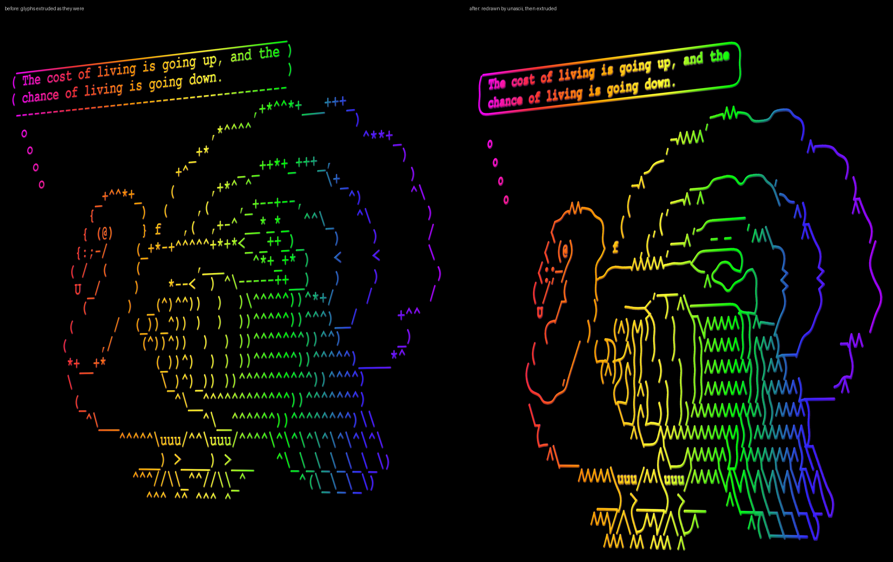

# unascii

ASCII art's job is to take a picture and turn it into printable characters.
`unascii` goes the other way: it takes terminal art (ASCII, ANSI colour, Unicode
blocks and braille) and redraws it as a clean line drawing, as a PNG or as
SIXEL for the terminal.

```
cowsay -f turkey "gobble" | unascii            # in a SIXEL terminal: shows it
unascii art.txt -o art.png                     # PNG, black on white
cowsay hi | unascii -o - | bidet3d             # ...and into BIDeT3D (see below)
```



Left: bidet3d's art mode as it was (the glyphs extruded). Right: the same art redrawn by unascii first.
`examples/` also has the flat line drawing (`turkey-lineart.png`) and a coloured ANSI half-block
picture traced in `tone` mode (`ansi-blocks-lineart.png`).

## How it works

Two reconstruction methods, picked per input by looking at which characters are
used (`-v` shows the numbers; `-m` forces one):

| mode | for | how |
|------|-----|-----|
| `line` | hand-drawn art: cowsay, figlet, boxes, `/ \ \| _ - ( ) ^ ' . ,` | Each character is a pen stroke. Stroke ends that meet are **joined into continuous lines** and gentle corners are rounded, so `_.-'''-._` becomes one smooth curve instead of a row of marks. `o` `O` `0` are rings, `^` `<` `>` are chevrons, box-drawing characters (light, heavy, double, rounded) are drawn exactly. Letters in words stay letters (`Moo` is text, `(oo)` is eyes). Joined strokes are **spline-smoothed**: staircases of `_` and `/` become diagonals and waves, while real corners (`^`, `<`, `|_`) stay sharp. cowsay **speech bubbles are closed** at the bottom. Runs of `X` (the filled regions of cowsay's ghostbusters) become **diagonal hatching**. |
| `tone` | picture-converted art: jp2a, chafa, caca, `.:-=+*#%@` ramps, half blocks `▀▄`, braille, coloured ANSI | The characters are ink density. The halftone is undone (averaged per dot: a cell, half a cell, a braille dot), the picture they were squinted from is rebuilt, and **outlines are traced at sub-pixel accuracy** (zero crossings of a difference of Gaussians). Gentle shading gets a few contour lines. |
| `mix` | line art with dense fills (`#`, `@`, `█`) | strokes for the line characters, outlines for the fills |

Input can be plain text, UTF-8 or CP437 `.ANS` files (SAUCE records are dropped),
with SGR colours, cursor movement, erase and wrap (`--cols`, 80 for `.ans`).
Colours only matter to `tone`, where they set the brightness of each dot.

## Options

```
unascii [FILE|-] [-o FILE.png | -o - | -s] [options]

-o, --output FILE    write a PNG ('-' = stdout).  Default: SIXEL if stdout is a
                     terminal, else a PNG on stdout
-s, --sixel          print SIXEL to stdout
-m, --mode MODE      auto (default), line, tone, mix
-c, --cell PX        width of one character cell in the output (default 12)
-a, --aspect R       cell height / width (default 2.0)
-w, --weight W       pen thickness (default 1; bidet3d wants 2-3)
-j, --join CELLS     line: join stroke ends up to this far apart (default 1, 0 = never)
    --no-round       line: no smoothing, keep every corner sharp
    --spline F       line: spline smoothing of joined strokes, in cell widths (default 0.6;
                     0 = only round the corners)
    --shade CHARS    line: runs of these characters are shading and get hatched (default X, '' = none)
    --hatch F        line: spacing of that hatching (default 1)
    --text-bold F    line: how much letters thicken when -w is above 1.2 (default 0.25; 0 = never)
    --smooth F       tone: blur in dot pitches (default 0.7); more = smoother contours
    --detail F       tone: smallest tonal step that gets an outline (default 0.12)
    --scale F        tone: finest outline feature (default 0.4)
    --levels N       tone: contour lines through shading (default 3, 0 = outlines only)
    --invert, --dark tone: art whose dense characters are *light* (jp2a's default is
                     for dark terminals: try --invert if the lines trace the wrong thing)
    --ink, --paper   colours (default black on white); --transparent for alpha
    --width PX       scale the result to this width
    --font FILE      monospace font for letters (default: DejaVu Sans Mono, Consolas, ...)
    --encoding ENC   input encoding (default UTF-8, else CP437)
-v                   say what was chosen and why
```

## With BIDeT3D

`bidet3d` has it built in: whenever it is in art mode (`-a`, or a piped
multi-line picture that it detects as ASCII art) it redraws the art with unascii
before extruding it, so the lines are continuous instead of rows of separate
glyphs. `--no-lineart` turns that off, `--lineart MODE` forces a mode, `--pen`
sets the thickness.

As a pipeline, anything that writes a PNG (or JPEG/GIF) to bidet3d's stdin is
extruded as a shape, so you can tune the drawing first:

```
fortune -s | cowthink -f turkey | unascii -w 2.5 -o - | bidet3d -P rainbow
unascii photo-art.txt -m tone -w 3 -o - | bidet3d -P chrome
```

bidet3d looks for `unascii.py` in `$BIDET3D_UNASCII`, `../unascii` next to a
source checkout, and where `make install` puts it (`share/BIDeT3D/unascii`).

## As a library

```python
import unascii
ink = unascii.render(text, mode="auto", cell_w=16, weight=1.5)   # float array, 1 = ink
img = unascii.mask(text, 16, 32)                                  # PIL 'L', 255 = ink
png = unascii.to_image(ink, fg=(0, 0, 0), bg=(255, 255, 255))     # PIL RGB
sx  = unascii.sixel(ink)                                          # bytes
```

## Requirements and limits

Python 3.7+, Pillow 5.4+, numpy 1.16+; nothing else (no scipy or OpenCV), so it
runs on the same old systems as BIDeT3D. Tested with Python 3.11 / Pillow 11 /
numpy 2.2 and Python 3.8 / Pillow 7.0 / numpy 1.17. SIXEL output was checked by
decoding it with libsixel's `sixel2png`.

- Tone mode cannot know which way round the picture was meant: dense characters
  are taken as dark ink (the print convention). jp2a without `--invert` is the other
  way round; add `--invert` to unascii for those.
- `line` reads each character on its own, so unusual art styles (letters used as
  shading, `#` mazes) come out as the font glyphs, not as strokes.
- Wide (CJK) characters are treated as one cell.

Boost Software License 1.0, like BIDeT (see `../3D/LICENSE`).
